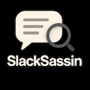

#  SlackSassin

**SlackSassin** is a sleek macOS app that brings AI-powered response suggestions into Slack—entirely on your machine using Ollama. The workflow runs:

Slack → Zapier → SlackSassin → Ollama → Slack

Review, edit, approve, or auto-send replies seamlessly from your Mac.

---

## 🚀 Overview

SlackSassin listens for Slack mentions or trigger events configured in Zapier, sends message content to a locally running Ollama model for response generation, and returns suggested replies. You can then:

- **Send immediately**  
- **Edit before sending**  
- **Create auto-response rules** for future similar messages

All within a polished, native macOS interface.

---

## 🛠️ Features

- **Inbox View**: Messages that triggered the Zap    
- **AI Reply Suggestions** from Ollama    
- **Rich Text Editing**: Format and tweak replies    
- **Auto‑Response Rules**: Save accepted replies as templates    
- **Analytics Dashboard**: Track message throughput, auto-responses, and edit rate    
- **History Log**: Review original messages and sent responses    
- **Menu Bar Integration** with badge notifications    
- **Settings Panel**: Monitor Slack, Zapier, ngrok, and Ollama status

---

## ✅ Requirements

- **Slack workspace** with the bot invited to channels    
- **Zapier account** for Slack trigger → webhook → Slack action    
- **Free ngrok account** (or alternative tunnel) for local webhook exposure    
- **macOS 12+** (Intel or Apple Silicon)    
- **Ollama** installed and running locally (e.g., via Homebrew)    
- **ngrok** installed and configured

---

## 🔧 Setup

1. **Install Ollama**    
   ```bash
   brew install ollama
   ollama pull llama2
   ```

2. **Install ngrok**
   ```bash
   brew install ngrok
   ngrok config add-authtoken <YOUR_TOKEN>
   ```

3. **Clone & Run SlackSassin**
   
   Build the macOS app—it runs a server on localhost:8080, pointed at Ollama's localhost:11434.

4. **Expose your endpoint**
   ```bash
   ngrok http 8080
   ```
   Copy the public HTTPS URL for Zapier.

5. **Configure your Zap**
   
   **Trigger**: Slack "New Mention" or "Message Posted"
   
   **Action 1**: Webhooks by Zapier → POST JSON to your ngrok URL /zapier-webhook
   
   **Map**: text, channel_id, thread_ts
   
   **Action 2**: Slack → Send Channel Message
   
   **Map**: Text → reply_text, Channel → channel_id, Thread Ts → thread_ts

6. **Invite the bot** to Slack channels and grant scopes like `chat:write`.

7. **Launch SlackSassin** and verify webhook and Ollama connectivity.

---

## 🙌 Acknowledgements & Credits

- **Ollama** — LLM runtime for local inference ([github.com/ollama/ollama](https://github.com/ollama/ollama))
- **Ollamac / OllamaKit** by Kevin Hermawan — Embedded for local chat support ([github.com/kevinhermawan/Ollamac](https://github.com/kevinhermawan/Ollamac))
- **Zapier** for orchestrating Slack integrations
- **ngrok** for secure local webhook exposure
- UI inspired by macOS Human Interface Guidelines

---

## 📁 Project Layout

```
SlackSassin/
 ┣ Ollamac/       # macOS app source code
 ┣ assets/        # including SlackSassin_Logo_128.png
 ┣ README.md      # This file
 ┣ LICENSE        # MIT License
 ┗ ZapSetup.md    # Guide for Zapier webhook setup
```

---

## 🛣️ Roadmap

- Template manager UI for custom replies
- Rule builder with keyword/channel conditions
- Feedback loop for Ollama improvements
- macOS Dark Mode support

---

## 🤝 Contributing

Contributions are welcome! Open issues or PRs for new features, improvements, or bug fixes.

---

## 📜 License

MIT License. See LICENSE for details.

Built with ❤️ using Ollama and Ollamac/OllamaKit — thank you Kevin Hermawan & the Ollama team!
